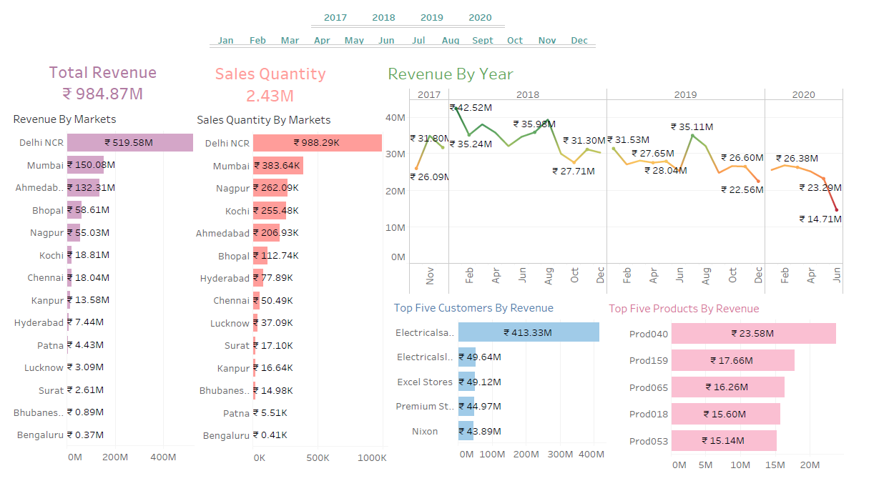
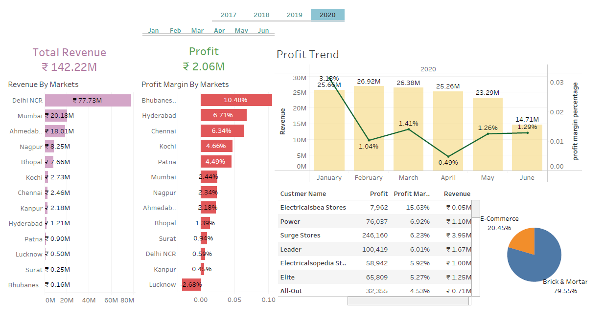

# Sales Analysis using Tableau
The Sales Data Analysis project is a data-driven exploration and analysis of sales and revenue data to extract valuable insights, patterns, and trends. In today's data-driven business landscape, understanding sales and revenue performance is crucial for making informed decisions, optimizing strategies, and achieving sustainable growth. This project focuses on leveraging data analytics and visualization techniques using MYSQL and Tableau to provide actionable recommendations based on historical sales and revenue data.

# Data Source
The data source is a relational database of a harware company. It contains following tables:
* Customers
* Date
* Markets
* Products
* Transactions

# Final Dashboards
Using the power of SQL and Tableau the following dashboards were created:
1) Sales and Revenue Analysis: This dashboard gives valueble insights about the sales and revenue with respect to markets and customers and identifies top customers and products based on the yearly and monthly filters. 

2) Profit Analysis: This dashboard gives valueble insights about profit and revenue with respect to markets, customers and cutomer types.

